# 黄浦区妇儿工作智能AI助手操作手册（第二版）

适用对象：街道、居委、妇联窗口及一线服务人员  
版本日期：2026年7月22日  
访问地址：http://112.64.45.22:8088/#/

## 1. 产品定位

黄浦区妇儿工作智能AI助手，是面向妇女儿童关爱、权益保护、家庭服务和普法宣传的一站式智能服务入口。它不是单纯的聊天工具，而是把“AI咨询、隐私保护、服务转介、专题宣传、普法互动、家庭云服务介绍”集中在一个页面内，方便街道人员在窗口接待、社区活动、入户宣传和居民咨询中快速使用。

平台的核心价值是：先把居民的问题接住，再帮助工作人员完成初步判断、信息整理和服务引导。

平台适合承担四类工作：

- 咨询引导：围绕妇女儿童权益、家庭关系、家暴应对、法律援助、儿童安全等问题，提供基础解释和求助建议。
- 风险提示：在居民提到家暴、威胁、伤害、儿童安全等情况时，提醒优先保障人身安全并转接人工服务。
- 服务转介：把居民引导到妇联维权、法律援助、心理服务等线下或热线服务渠道。
- 宣传教育：通过妇女发展、儿童成长、家庭建设专题和巾帼普法挑战赛，辅助开展社区宣传和普法活动。

需要特别说明：AI回答仅供参考，不能替代公安、法院、法律援助、心理咨询、社工等专业处置。遇到即时人身危险，应优先拨打110。

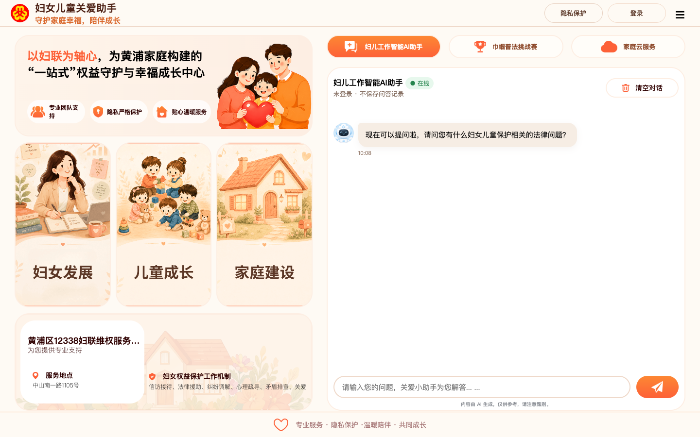

## 2. 产品结构与特色功能

### 2.1 妇儿工作智能AI助手

这是平台的主要咨询入口。居民或工作人员可以在输入框中输入问题，AI会围绕妇女儿童保护、婚姻家庭权益、儿童安全、法律援助、家庭关系等主题给出基础答复。

典型提问包括：

- 遭遇家暴怎么办？
- 如何申请法律援助？
- 儿童网络安全要注意什么？
- 我的婚姻家庭权益有哪些？
- 居民想咨询保护令，应该先准备什么？

使用建议：

- 一次只问一个主题，回答会更清晰。
- 尽量用事实描述问题，不要输入身份证号、完整住址、银行卡号、未成年人详细身份信息等非必要敏感内容。
- AI回答后，工作人员应结合实际风险判断是否需要转人工服务。

### 2.2 特色功能：隐私保护

“隐私保护”是本产品的重要特色，使用体验类似苹果 Safari 浏览器的“无痕浏览”。

开启隐私保护后，本次问答只在当前页面临时显示，不会写入用户的问答记录。这样可以减少敏感咨询留下记录的顾虑，更适合居民咨询家庭矛盾、家暴经历、心理压力、未成年人保护等隐私性较强的问题。

隐私保护适合以下场景：

- 居民明确表示不希望保存咨询记录。
- 咨询内容涉及家暴、婚姻矛盾、伤情、未成年人信息等敏感内容。
- 街道人员现场临时演示或临时帮助居民梳理问题。
- 不需要后续从历史记录中继续跟进的咨询。

使用方式：

1. 登录后点击右上角“隐私保护”。
2. 页面显示“隐私保护中”后，本次问答不会保存到历史记录。
3. 如需恢复历史记录保存，再次点击关闭隐私保护。

注意：隐私保护只表示平台不记录本次问答数据；工作人员仍应避免主动收集或输入不必要的个人敏感信息。

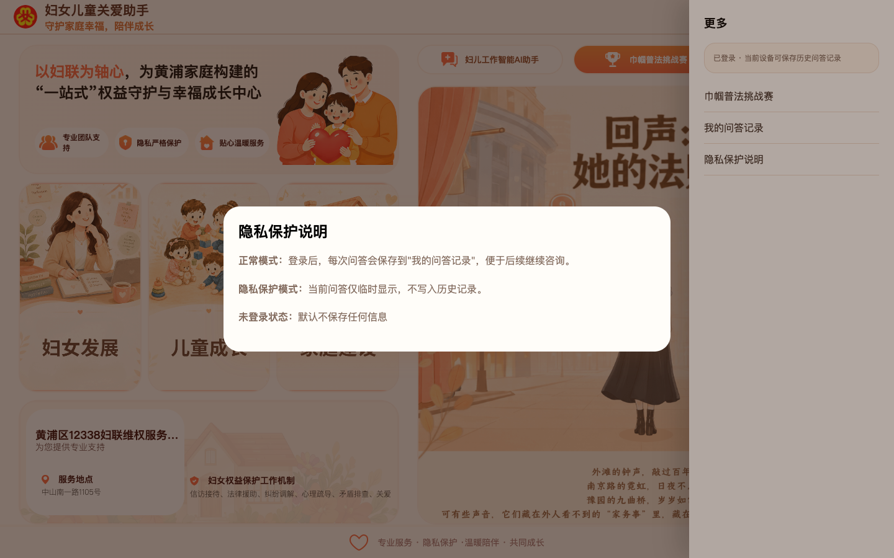

### 2.3 用户注册与登录

平台不建议共用固定账号。街道人员应引导用户自行注册并登录，便于用户管理自己的问答记录，也避免多人共用账号造成隐私混淆。

注册登录流程：

1. 点击页面右上角“登录”。
2. 如已有账号，输入手机号和密码，点击“确认登录”。
3. 如没有账号，点击“没有账号？去注册”。
4. 注册时输入手机号、密码和确认密码。
5. 注册成功后再登录使用。

登录后的状态变化：

- 未登录：问答不会保存。
- 已登录且未开启隐私保护：问答可保存到“我的问答记录”。
- 已登录且开启隐私保护：本次问答不会写入历史记录。

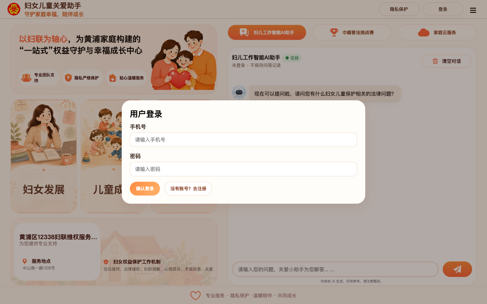
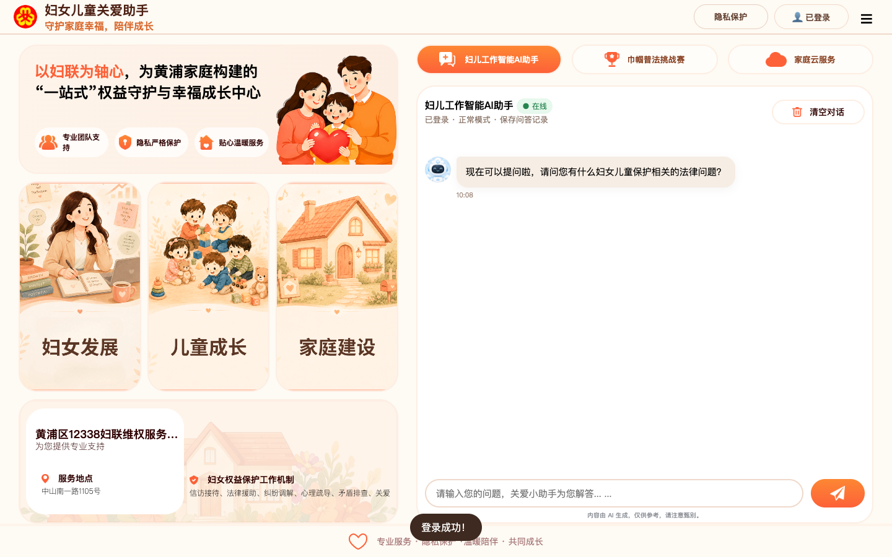

### 2.4 我的问答记录

“我的问答记录”用于查看登录状态下保存过的历史咨询。点击右上角“☰”，再点击“我的问答记录”即可查看。

使用建议：

- 需要持续跟进的问题，可建议居民登录后再咨询。
- 居民不希望保存记录时，应开启隐私保护。
- 历史记录只用于回看咨询内容，不等同于街道、妇联或其他系统的正式受理记录。

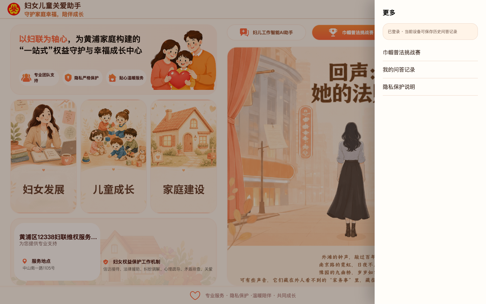

### 2.5 妇女发展专题

点击主页左侧“妇女发展”卡片，会打开“妇女发展专题”抽屉。该专题用于展示黄浦妇女发展工作、巾帼品牌建设、女性典型宣传、女性职业发展和公益项目等内容。

页面介绍内容包括：

- 共传巾帼之声：打造黄浦特色巾帼思政品牌，挖掘各行各业女性典型故事。
- 共融发展生态：推动区、街、居三级妇联组织建设和新兴领域妇联组织覆盖。
- 共拓职场新路：围绕灵活就业、自主创业、生育友好岗、家政服务等方向提供支持。
- 共振成长脉动：提供政治引领、职场提升、家庭教育、亲子活动、文化休闲等礼遇。
- 共谱公益新篇：联动公益伙伴，打造妇女儿童家庭服务公益项目。

该专题还包含视频入口：

- 黄浦韵巾帼志：3个视频入口。
- 海上她故事：5个视频入口。

使用场景：

- 适合妇女发展工作介绍。
- 适合社区活动、妇联宣传、成果展示时播放。
- 适合让街道人员快速了解黄浦妇女发展工作亮点。

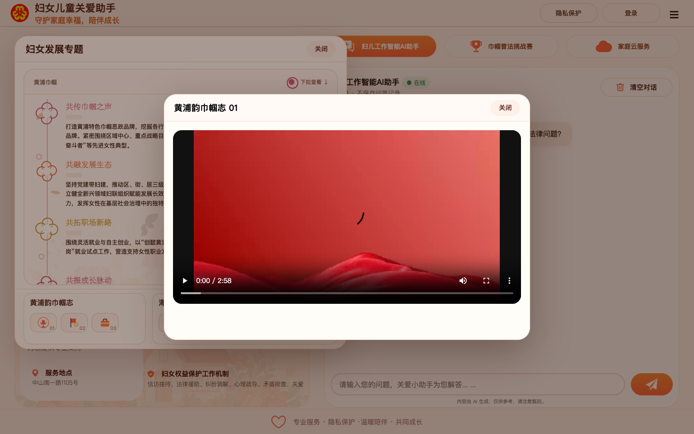

### 2.6 儿童成长专题

点击主页左侧“儿童成长”卡片，会打开“儿童成长专题”抽屉。该专题围绕“黄浦儿童友好”展开，展示儿童友好城区建设、儿童参与、儿童成长护航和未成年人保护等内容。

页面介绍内容包括：

- 构筑“童联盟”：发起儿童友好联盟伙伴计划，推动多元主体协同参与儿童友好城区建设。
- 点亮“童乐园”：以“1米高度”看城市，推进儿童友好公共空间和示范空间建设。
- 创新“童参与”：建立儿童议事网络，拓宽儿童建言渠道。
- 护航“童成长”：围绕健康服务、教育赋能、儿童安全、权益保障、成长环境等方面落实举措。
- 筑牢“童守护”：深化未成年人保护工作，推动家庭、学校、社会、网络、政府、司法“六大保护”衔接。

该专题还包含4个儿童成长视频入口，可用于儿童友好宣传和活动展示。

使用场景：

- 适合儿童友好城区宣传。
- 适合未成年人保护、儿童安全、家庭教育主题活动。
- 适合街道人员向居民介绍儿童成长相关服务理念。

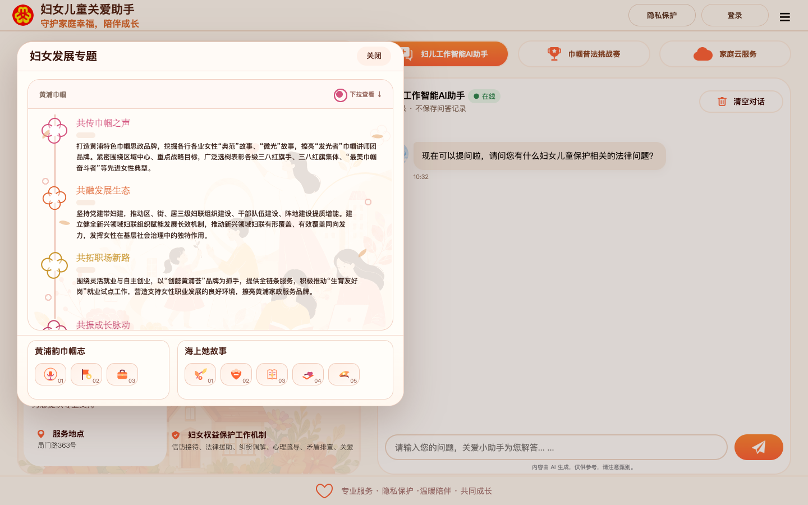

### 2.7 家庭建设专题

点击主页左侧“家庭建设”卡片，会打开“家庭建设专题”抽屉。该专题围绕家庭文化、家庭教育、家庭参与、家庭服务、家庭平安等方向，展示黄浦家庭建设工作。

页面介绍内容包括：

- 吾家：健全“家文化”体系，打造“家+书屋”等家庭教育新空间。
- 吾童：实施“家教育”行动，推进校家社协同育人。
- 吾社：凝聚“家参与”合力，培育家庭友好公益项目和志愿社群。
- 吾惠：推动“家服务”计划，提供婚姻家庭“全周期”“全链条”公益指导服务。
- 吾安：开展“家平安”项目，强化权益保障和婚姻家庭纠纷预防化解。

该专题还包含视频入口：

- 暖暖FAM力：5个视频入口。
- 普法微电影：2个视频入口。

使用场景：

- 适合家庭文明建设宣传。
- 适合婚姻家庭指导、家庭教育、家庭服务介绍。
- 适合普法宣传和社区活动播放。

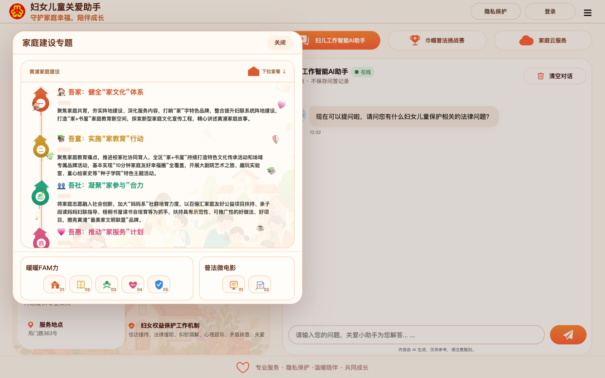

### 2.8 家庭云服务

点击顶部“家庭云服务”页签，可查看家庭全生命周期和家庭服务相关介绍。

家庭全生命周期包括：

- 婚姻服务：婚恋指导、婚姻登记、家庭辅导。
- 生育支持：孕产关怀、母婴服务、育儿指导。
- 儿童成长：教育资源、成长陪伴、安全守护。
- 老年生活：健康养老、文化生活、关爱服务。
- 身后事：殡葬指引、法律咨询、暖心陪伴。

家庭服务包括：

- 家庭健康
- 家庭出行
- 家庭证明
- 家庭住房
- 家庭保障
- 家庭教育

页面提示可通过“随申办”进入黄浦旗舰店的家庭云服务。

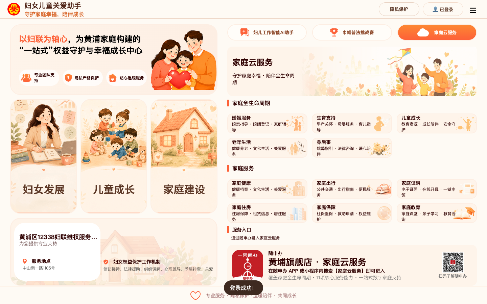

### 2.9 服务信息

服务信息用于查询妇联维权、法律援助、心理服务等人工服务渠道。手机端有独立“服务信息”入口，适合一线人员现场查看和复制电话。

当前页面展示的服务渠道：

| 服务名称 | 地址 | 联系方式与时间 |
|---|---|---|
| 黄浦区12338妇联维权服务中心 | 黄浦区中山南一路1105号 | 021-53068792；上午9:00-11:30，下午13:30-16:30，法定节假日除外 |
| 黄浦区法律援助中心妇联分中心 | 瞿溪路1190号 | 021-63162431；周二、周五13:00-16:00 |
| 黄浦区妇联心理服务工作站 | 局门路363号 | 63288361-0；周六13:30-17:00 |

使用建议：

- AI回答后，如居民需要人工帮助，可引导其查看服务信息。
- 涉及家暴、人身威胁、儿童安全等紧急情况，应优先拨打110。
- 服务信息适合做转介指引，不代表线上直接完成受理。

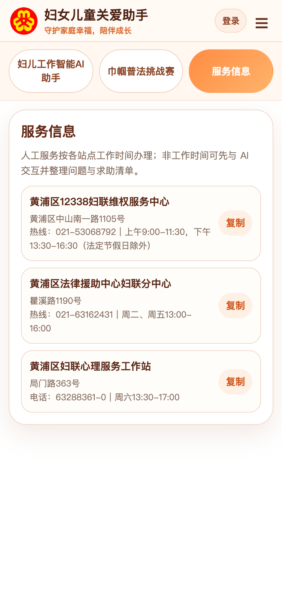

### 2.10 巾帼普法挑战赛

“巾帼普法挑战赛”是互动学习模块，通过案例闯关方式帮助工作人员和居民了解妇女权益保护相关知识。

桌面端展示为故事闯关形式，内容包括性骚扰识别、用人单位责任、女职工婚育权益、夫妻共同财产、离婚诉讼财产调查等案例。手机端为五关选择题模式，强调安全优先、隐私保护、专业转介等原则。

使用建议：

- 可用于活动现场的普法互动。
- 可作为街道人员培训时的热身练习。
- 不建议把游戏结果作为个案处理依据。

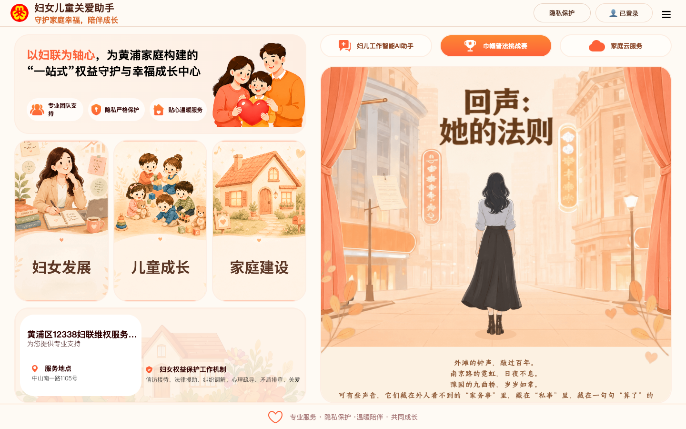

## 3. 基础操作流程

### 3.1 注册账号

1. 打开访问地址：http://112.64.45.22:8088/#/
2. 点击右上角“登录”。
3. 点击“没有账号？去注册”。
4. 输入手机号、密码、确认密码。
5. 点击“确认注册”。
6. 注册完成后回到登录状态。

### 3.2 登录使用

1. 点击右上角“登录”。
2. 输入用户自行注册的手机号和密码。
3. 点击“确认登录”。
4. 右上角显示“已登录”，表示登录成功。

### 3.3 使用AI咨询

1. 进入“妇儿工作智能AI助手”页签。
2. 在底部输入框输入问题。
3. 点击发送按钮。
4. 等待AI回复。
5. 根据回答判断是否需要转人工服务。

建议提问方式：

- 把问题说清楚，例如“居民想咨询遭遇家庭暴力后如何求助”。
- 一次只问一个主题。
- 不输入不必要的敏感个人信息。

### 3.4 使用隐私保护

1. 登录后点击右上角“隐私保护”。
2. 看到“隐私保护中”后开始咨询。
3. 本次问答不会记录到历史记录。
4. 如需恢复记录保存，再次点击关闭隐私保护。

### 3.5 查看服务电话

1. 手机端点击顶部“服务信息”；桌面端可查看服务区域。
2. 找到对应服务点。
3. 点击“复制”按钮复制电话，或直接拨打。
4. 告知居民服务时间和地址。

### 3.6 查看专题和视频

1. 在主页左侧点击“妇女发展”“儿童成长”或“家庭建设”卡片。
2. 弹出专题抽屉后，可下拉查看介绍内容。
3. 在底部视频区域点击视频图标。
4. 视频弹窗打开后可播放或关闭。

## 4. 街道人员使用建议

### 4.1 适合直接使用的场景

- 居民咨询妇女儿童权益保护基础问题。
- 居民不清楚应联系哪个服务点。
- 工作人员需要快速整理求助清单。
- 社区普法活动中进行互动学习。
- 日常窗口服务中辅助解释服务路径。
- 社区活动中展示妇女发展、儿童成长、家庭建设专题内容。

### 4.2 需要转人工的场景

以下情况不要只依赖AI回答，应及时转人工或提醒居民联系专业部门：

- 居民或儿童存在即时人身危险。
- 涉及家庭暴力、威胁、跟踪、伤害等风险。
- 涉及报警、保护令、诉讼、离婚财产、抚养权等具体法律程序。
- 居民出现严重心理危机、极端情绪或自伤风险。
- 涉及未成年人保护、监护失当、虐待、性侵等敏感个案。

紧急情况优先拨打110。AI可以帮助整理信息，但不能替代正式处置。

### 4.3 对居民的推荐话术

“这个小助手可以先帮您把问题梳理清楚，并提供基本的求助方向。您也可以开启隐私保护，类似无痕浏览，本次问答不会保存到历史记录。AI回答仅供参考，如果涉及人身安全、法律程序或心理危机，我们会帮您转接到妇联维权、法律援助、心理服务或公安等专业渠道。”

## 5. 注意事项

- 平台应引导用户自行注册并登录，不建议多人共用固定账号。
- AI回答仅供参考，不能作为正式法律意见或行政处理结论。
- 隐私保护开启后，本次问答不会写入历史记录，更适合敏感咨询。
- 不建议输入身份证号、完整住址、银行卡号、未成年人详细身份信息等敏感内容。
- 遇到家暴、人身威胁、儿童安全风险，应优先保障安全并联系110或人工服务。
- 历史记录主要用于回看，不等同于街道或妇联系统正式受理记录。