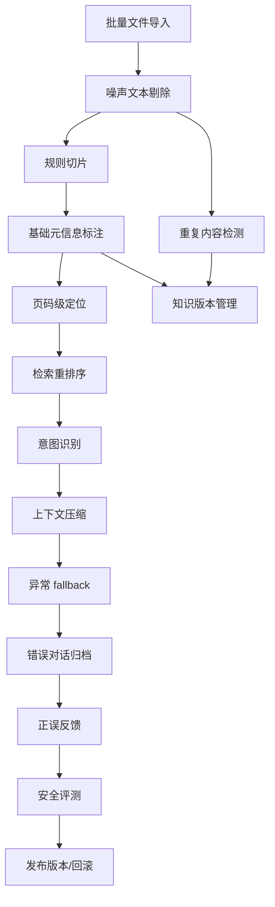

# 原子能力建设需求文档

> 面向后续开发拆解使用。本文不绑定政务场景，只围绕 `6qiyeagent` 作为企业智能体中台需要补齐的通用原子能力。
>
> 覆盖范围：规则切片、基础元信息标注、重复内容检测、噪声文本剔除、检索重排序、意图识别、上下文压缩、异常 fallback、正误反馈、错误对话归档、批量文件导入、知识版本管理、页码级定位、安全评测、发布版本/回滚。

## 1. 项目判断

### 1.1 当前基础

`6qiyeagent` 已经具备一条完整主链路：

| 链路 | 当前能力 | 可复用基础 |
|---|---|---|
| 知识库 | 单文件上传、解析、切片、向量化、状态展示、重建索引 | `documents.meta`、`chunks.meta`、`parse_status`、对象存储 |
| 检索 | vector、keyword、hybrid，来源片段引用 | `retrieve_chunks`、`CitationOut`、rerank 预留钩子 |
| 智能体 | persona、config、知识库绑定、工具绑定、调试对话 | `Agent.config`、`build_agent_context`、`RunTrace` |
| 工具 | HTTP、code、builtin、MCP 配置保存 | `Tool.config`、工具执行状态 |
| 观测 | trace、dashboard、audit、eval | `RunTrace`、`AuditLog`、`EvalCase`、`EvalRun` |
| 发布 | PublishedApp、API Key、公开调用接口 | `published_apps`、`app_api_keys` |

### 1.2 核心问题

当前平台已经能“跑通”，但要成为可长期使用的企业智能体平台，还缺 4 类能力：

| 问题 | 表现 | 对应能力 |
|---|---|---|
| 知识入库质量不稳定 | PDF/DOCX 噪声、重复、切片边界不准、缺少来源信息 | 规则切片、元信息、去重、噪声剔除、批量导入、版本管理、页码定位 |
| 检索和回答缺少精细控制 | hybrid 后没有真正 rerank，长会话成本和稳定性不足 | 检索重排序、上下文压缩、意图识别 |
| 线上失败不可系统复盘 | 失败有 trace，但没有产品化归档、分类和反馈闭环 | 异常 fallback、正误反馈、错误对话归档 |
| 发布后缺少版本运营能力 | app 发布是状态切换，缺少版本快照、回滚和发布前评测门禁 | 发布版本/回滚、安全评测 |

### 1.3 总体建设原则

1. 先做知识质量地基，再做智能体运行时增强。
2. 每个能力都要留下结构化数据，不只做前端提示。
3. 所有自动能力都要可关闭、可审计、可回滚。
4. 不引入重型平台依赖，优先使用现有 FastAPI、Postgres、pgvector、MinIO、MaaS。
5. 对外口径只承诺已实现和可配置项，探索性能力标注为实验。

## 2. 总体里程碑

### 2.1 建议顺序

| 阶段 | 名称 | 包含能力 | 目标 |
|---|---|---|---|
| M1 | 知识入库质量提升 | 批量文件导入、噪声文本剔除、重复内容检测、规则切片、基础元信息标注 | 让知识库从“能入库”变成“高质量入库” |
| M2 | 引用与检索增强 | 页码级定位、检索重排序、知识版本管理 | 让答案更可信、检索更准、知识可运营 |
| M3 | 智能体运行时增强 | 意图识别、上下文压缩、异常 fallback | 让智能体更稳、更省、更可控 |
| M4 | 反馈与治理闭环 | 正误反馈、错误对话归档、安全评测 | 让问题可发现、可复盘、可持续优化 |
| M5 | 发布运营能力 | 发布版本/回滚 | 让智能体上线具备版本治理和回退能力 |

### 2.2 推荐排期

| 周期 | 工作内容 | 交付物 |
|---|---|---|
| 第 1-2 周 | M1 入库质量 | 批量上传、规则切片、清洗、去重、元信息基础接口和 UI |
| 第 3-4 周 | M2 检索引用 | 页码 citation、rerank、文档版本模型和版本列表 |
| 第 5-6 周 | M3 运行时 | 意图识别、上下文摘要压缩、fallback 策略配置 |
| 第 7 周 | M4 反馈治理 | 点赞点踩、错误归档、安全评测用例和报告 |
| 第 8 周 | M5 发布运营 | 发布版本快照、回滚、发布前门禁 |

### 2.3 技术依赖关系

## 3. 目标架构

### 3.1 知识处理流水线

现状是“上传 - 解析 - 切片 - 向量化”。建议改为：

### 3.2 智能体运行流水线

现状是“构建上下文 - 调模型 - 工具 loop - 最终回答”。建议改为：

## 4. 详细需求

### 4.1 批量文件导入

**目标**

支持一次上传多个文档，并可查看每个文件的校验、上传、解析、切片、向量化状态。

**用户故事**

作为知识库管理员，我希望一次上传一批资料，并能看到哪些成功、哪些失败、失败原因是什么，避免逐个上传和重复排查。

**功能需求**

| 编号 | 需求 |
|---|---|
| BR-1 | 知识库文档上传接口支持多文件，或新增批量上传接口 |
| BR-2 | 每个文件独立校验类型、大小、重名、重复内容 |
| BR-3 | 批量任务返回 batch_id，前端展示批次进度 |
| BR-4 | 支持部分成功，不因单个文件失败导致整批失败 |
| BR-5 | 支持批次结果导出或复制失败清单 |

**技术路线**

| 层 | 实现建议 |
|---|---|
| 数据库 | 新增 `document_batches` 表，或先用 `documents.meta.batch_id` 轻量实现 |
| 后端 | 新增 `POST /kbs/{kb_id}/documents/batch`，接收 `list[UploadFile]` |
| 任务 | 每个 Document 独立入队，batch 只负责聚合状态 |
| 前端 | 知识库详情页增加“批量上传”弹窗和批次结果表 |

**验收标准**

| 指标 | 标准 |
|---|---|
| 批量上传 | 一次上传 20 个文件，成功和失败可分别展示 |
| 部分失败 | 1 个文件格式不支持时，其他文件不受影响 |
| 状态准确 | 批次总数、成功数、失败数、处理中数量准确 |
| 审计 | 记录批量上传操作、文件数量、失败数量 |

### 4.2 噪声文本剔除

**目标**

在切片前清理无意义内容，降低错误召回和超短切片比例。

**功能需求**

| 编号 | 需求 |
|---|---|
| NC-1 | 清理连续空白、乱码控制字符、重复空行 |
| NC-2 | 识别并移除常见页眉、页脚、页码行 |
| NC-3 | 支持配置保留/移除目录、版权声明、免责声明 |
| NC-4 | 在 `document.meta.ingest_task` 中记录清洗前后字符数、删除行数 |
| NC-5 | 保留原始解析文本的可追溯能力，避免不可逆清洗导致问题难查 |

**技术路线**

| 层 | 实现建议 |
|---|---|
| RAG | 新增 `backend/app/rag/cleaning.py` |
| 配置 | `kb.config.cleaning` 支持 `enabled`、`remove_headers`、`remove_footers`、`remove_toc` |
| 元数据 | chunk meta 记录 `cleaning_version` |
| 测试 | 使用 fixtures 覆盖页眉页脚、目录、乱码、空段 |

**验收标准**

| 指标 | 标准 |
|---|---|
| 清洗效果 | 样本文档超短切片比例下降 30% 以上 |
| 可追踪 | 文档详情能看到清洗统计 |
| 可关闭 | 管理员关闭清洗后入库行为回到原逻辑 |

### 4.3 重复内容检测

**目标**

减少重复文档和重复切片，降低存储、向量化成本和重复召回。

**功能需求**

| 编号 | 需求 |
|---|---|
| DD-1 | 上传时计算文件 hash，识别完全重复文件 |
| DD-2 | 解析后计算文本 fingerprint，识别同内容不同文件名 |
| DD-3 | 切片后识别完全重复切片 |
| DD-4 | 对近似重复内容给出提示，不自动删除 |
| DD-5 | 重复结果写入 `Document.meta` 和知识库健康报告 |

**技术路线**

| 类型 | 做法 |
|---|---|
| 文件重复 | SHA-256 |
| 文本重复 | 规范化文本后 SHA-256 |
| 切片重复 | 规范化 chunk content 后 hash |
| 近似重复 | P1 可使用 simhash 或 embedding 相似度，先不阻断上传 |

**验收标准**

| 指标 | 标准 |
|---|---|
| 完全重复 | 同一文件重复上传能提示已存在 |
| 同内容不同名 | 改文件名上传仍能提示疑似重复 |
| 召回质量 | 重复切片不会在 top_k 中挤占多个位置 |

### 4.4 规则切片

**目标**

支持按文档结构切片，而不是只按固定长度切片。

**功能需求**

| 编号 | 需求 |
|---|---|
| RC-1 | 知识库配置支持切片策略：simple、markdown_heading、numbered_section、paragraph |
| RC-2 | Markdown 按标题层级切片 |
| RC-3 | 普通文本按章节编号、条款编号切片 |
| RC-4 | 单个结构片段超长时再按 chunk_size 二次切分 |
| RC-5 | chunk meta 记录标题路径、章节编号、页码范围 |

**技术路线**

| 层 | 实现建议 |
|---|---|
| RAG | 扩展 `chunk_text` 为策略入口，如 `chunk_document(text, strategy, options)` |
| 数据 | chunk meta 增加 `heading_path`、`section_no`、`page_start`、`page_end` |
| UI | 知识库创建/编辑增加切片策略和预览 |
| 测试 | Markdown、编号制度、普通段落三类 fixture |

**验收标准**

| 指标 | 标准 |
|---|---|
| 结构准确 | Markdown 标题路径能写入 chunk meta |
| 可退化 | 识别不到结构时自动退回 simple |
| 检索改善 | 同一测试集 citation 命中片段可读性提升 |

### 4.5 基础元信息标注

**目标**

为文档和切片建立统一元信息，支撑筛选、引用、版本、重排序和治理。

**元信息字段**

| 字段 | 范围 | 说明 |
|---|---|---|
| source_name | document | 来源名称 |
| source_type | document | upload、api、sync、manual |
| author | document | 作者或维护人 |
| publisher | document | 发布单位或归属部门 |
| published_at | document | 发布时间 |
| effective_at | document | 生效时间 |
| expired_at | document | 失效时间 |
| version_label | document | 版本号或版本名称 |
| tags | document/chunk | 标签 |
| title_path | chunk | 标题路径 |
| page_start/page_end | chunk | 页码范围 |

**功能需求**

| 编号 | 需求 |
|---|---|
| BM-1 | 文档上传时可填写基础元信息 |
| BM-2 | 文档详情页可编辑元信息 |
| BM-3 | 系统自动抽取候选标题、日期、作者或发布者 |
| BM-4 | 检索接口支持按标签、来源、有效期过滤 |
| BM-5 | 引用展示来源名称、版本、页码 |

**技术路线**

| 层 | 实现建议 |
|---|---|
| 数据库 | 先复用 `documents.meta`，后续高频过滤字段再升列 |
| Schema | 新增 `DocumentMetaUpdate`、`DocumentMetaOut` |
| API | `PATCH /documents/{document_id}/meta` |
| 抽取 | 规则抽取优先，LLM 抽取作为可选增强 |

**验收标准**

| 指标 | 标准 |
|---|---|
| 可编辑 | 元信息修改后检索引用能展示新值 |
| 可过滤 | 同一知识库中按标签过滤结果正确 |
| 可审计 | 元信息变更写入 AuditLog |

### 4.6 页码级定位

**目标**

引用从“文档名 + 切片序号”升级为“文档名 + 页码 + 片段 + 可定位上下文”。

**功能需求**

| 编号 | 需求 |
|---|---|
| PG-1 | PDF 解析保留页码边界 |
| PG-2 | DOCX/MD/TXT 至少保留段落序号，页码可为空 |
| PG-3 | chunk meta 记录 page_start、page_end、paragraph_start、paragraph_end |
| PG-4 | CitationOut 返回页码和定位字段 |
| PG-5 | 前端引用详情可展示页码、上下文切片和原始文档信息 |

**技术路线**

| 层 | 实现建议 |
|---|---|
| Parser | PDF 输出结构化 `ParsedBlock`，包含 text、page、block_index |
| Chunking | 从 block 聚合成 chunk，计算页码范围 |
| Schema | 扩展 `CitationOut` 和 `RetrievedChunkOut` |
| UI | 引用卡片展示“第 N 页” |

**验收标准**

| 指标 | 标准 |
|---|---|
| PDF 页码 | 样本 PDF 的 citation 页码与原文一致 |
| 兼容性 | 非 PDF 不报错，页码为空但仍可定位切片 |
| 回归 | 原有片段级引用展示不破坏 |

### 4.7 检索重排序

**目标**

提升召回结果最终排序质量，减少低相关片段进入模型上下文。

**功能需求**

| 编号 | 需求 |
|---|---|
| RR-1 | 支持 rerank_mode：off、rule、model |
| RR-2 | rule 模式按 hybrid_score、元信息权重、热度、时效综合排序 |
| RR-3 | model 模式调用 MaaS rerank 或 LLM 打分接口 |
| RR-4 | trace 记录 rerank 输入数量、输出数量、耗时、模式 |
| RR-5 | 检索测试页展示重排序前后分数 |

**技术路线**

| 模式 | 做法 |
|---|---|
| off | 保持当前行为 |
| rule | 在 `rerank_candidates` 中计算 composite_score |
| model | 新增 MaaS rerank client，失败时降级 rule 或 off |

**验收标准**

| 指标 | 标准 |
|---|---|
| 可配置 | 每个知识库或智能体可配置 rerank_mode |
| 可降级 | rerank 服务失败时不影响回答主链路 |
| 效果 | 固定测试集 top1 命中率提升或持平，延迟增量可见 |

### 4.8 知识版本管理

**目标**

支持文档版本、切片版本和知识库可回溯，避免资料更新后无法追踪。

**功能需求**

| 编号 | 需求 |
|---|---|
| KV-1 | 文档支持创建新版本，而不是只能重名拒绝 |
| KV-2 | 同一逻辑文档下可查看版本列表 |
| KV-3 | 每个版本有 active、inactive、archived 状态 |
| KV-4 | 支持版本差异摘要和变更切片数量 |
| KV-5 | 支持回滚到历史版本并重新索引 |

**技术路线**

| 层 | 实现建议 |
|---|---|
| 数据库 | 新增 `document_groups` 或在 `documents` 加 `logical_doc_id`、`version_no`、`version_status` |
| 差异 | 使用文本 diff 生成 summary，记录到 `documents.meta.diff` |
| 检索 | 默认只检索 active 版本切片 |
| UI | 文档列表增加版本入口 |

**验收标准**

| 指标 | 标准 |
|---|---|
| 版本隔离 | inactive 版本不会被检索到 |
| 回滚 | 回滚后 citation 指向回滚版本 |
| 审计 | 新版本、激活、回滚均有审计记录 |

### 4.9 意图识别

**目标**

在回答前识别用户意图，用于选择检索策略、工具策略和 fallback 策略。

**意图分类建议**

| intent | 说明 |
|---|---|
| kb_qa | 知识问答 |
| doc_lookup | 查找资料或出处 |
| task_action | 需要调用工具完成任务 |
| data_query | 查询结构化数据 |
| chit_chat | 普通闲聊 |
| unsupported | 超出智能体边界 |
| unsafe | 安全风险或越权请求 |

**功能需求**

| 编号 | 需求 |
|---|---|
| IN-1 | 智能体配置中可开启/关闭意图识别 |
| IN-2 | 返回 intent、confidence、reason、recommended_policy |
| IN-3 | 低置信度时触发澄清问题 |
| IN-4 | unsafe/unsupported 走固定拒答或转人工文案 |
| IN-5 | trace 记录意图识别结果 |

**技术路线**

| 方案 | 建议 |
|---|---|
| 第一阶段 | 规则 + 轻量 LLM JSON 分类 |
| 第二阶段 | 基于 eval/反馈沉淀小型分类数据集 |
| 接入点 | `run_agent` 中 build context 前执行 |

**验收标准**

| 指标 | 标准 |
|---|---|
| 准确率 | 预置 100 条测试问题，意图准确率 >= 85% |
| 稳定性 | LLM 分类失败时降级为 kb_qa |
| 可观测 | trace 中可看到 intent 和 confidence |

### 4.10 上下文压缩

**目标**

控制长会话成本，降低历史消息挤占知识片段和系统提示词的风险。

**功能需求**

| 编号 | 需求 |
|---|---|
| CC-1 | 支持 history_strategy：recent_only、summary、hybrid |
| CC-2 | 超过 token 阈值时自动生成会话摘要 |
| CC-3 | 摘要保留用户目标、已确认事实、待办事项、关键约束 |
| CC-4 | 摘要写入 conversation meta 或独立表 |
| CC-5 | trace 记录压缩前后 token、被压缩消息数 |

**技术路线**

| 层 | 实现建议 |
|---|---|
| 数据库 | 给 `conversations` 增加 `meta`，或新增 `conversation_summaries` |
| Orchestrator | 在 `load_history` 后增加 `compress_history_if_needed` |
| 模型 | 使用当前默认 LLM，失败时降级 recent_only |

**验收标准**

| 指标 | 标准 |
|---|---|
| 成本 | 30 轮会话上下文 token 降低 40% 以上 |
| 质量 | 摘要后仍能回答已确认事实 |
| 降级 | 摘要失败不影响继续对话 |

### 4.11 异常 fallback

**目标**

为模型、检索、工具、解析、rerank 等失败提供统一降级策略和用户可理解反馈。

**功能需求**

| 编号 | 需求 |
|---|---|
| FB-1 | 定义统一错误类型：model_error、retrieval_empty、tool_error、timeout、policy_blocked |
| FB-2 | 智能体可配置 fallback 文案和策略 |
| FB-3 | 无引用但要求 grounded 回答时，返回“不确定”而不是编造 |
| FB-4 | 工具失败支持重试、备用工具或解释失败 |
| FB-5 | fallback 结果进入错误对话归档 |

**技术路线**

| 层 | 实现建议 |
|---|---|
| Core | 新增 `runtime_fallback.py` |
| Config | `Agent.config.fallback` |
| Trace | root_trace.output 增加 `fallback_applied`、`fallback_reason` |
| UI | 对话验证页展示 fallback 标签 |

**验收标准**

| 指标 | 标准 |
|---|---|
| 可控 | 模型超时、工具失败、无检索结果都有明确 fallback |
| 不编造 | citation_required 场景无引用时不输出肯定答案 |
| 可复盘 | fallback 对话进入错误归档 |

### 4.12 正误反馈

**目标**

让用户对回答质量进行标注，形成评测用例、经验库和知识优化线索。

**功能需求**

| 编号 | 需求 |
|---|---|
| FF-1 | 对助手消息支持点赞、点踩、原因、备注 |
| FF-2 | 点踩原因支持：不准确、无依据、引用错误、格式不对、工具失败、其他 |
| FF-3 | 反馈可关联 message、conversation、trace、agent、citations |
| FF-4 | 支持把反馈转为 eval case |
| FF-5 | 支持把优秀回答沉淀为 experience |

**技术路线**

| 层 | 实现建议 |
|---|---|
| 数据库 | 新增 `message_feedback` 表 |
| API | `POST /messages/{message_id}/feedback`、`GET /feedback` |
| UI | 对话结果卡片增加反馈入口 |
| 治理 | 反馈列表支持筛选和转评测 |

**验收标准**

| 指标 | 标准 |
|---|---|
| 关联完整 | 反馈能追溯到原问题、答案、引用、trace |
| 转化 | 点踩反馈可一键生成 eval case 草稿 |
| 统计 | dashboard 展示满意率和主要失败原因 |

### 4.13 错误对话归档

**目标**

自动识别和归档问题对话，形成修复队列。

**归档规则**

| 规则 | 触发条件 |
|---|---|
| no_citation | 要求引用但 citation_count = 0 |
| tool_failed | 任一工具执行失败 |
| model_failed | 模型调用异常 |
| fallback_applied | 触发 fallback |
| user_negative_feedback | 用户点踩 |
| low_eval_score | 评测未通过 |
| high_latency | 超过延迟阈值 |

**功能需求**

| 编号 | 需求 |
|---|---|
| EA-1 | 新增错误归档表，记录原因、严重度、状态、责任人、备注 |
| EA-2 | 运行时自动创建归档记录 |
| EA-3 | 支持人工关闭、忽略、转 eval case、转知识优化任务 |
| EA-4 | dashboard 展示错误趋势和 Top 原因 |
| EA-5 | 支持按 agent、知识库、工具、时间筛选 |

**技术路线**

| 层 | 实现建议 |
|---|---|
| 数据库 | 新增 `conversation_incidents` |
| 服务 | 新增 `incident_service.py` |
| 接入 | `run_agent` 结束后根据 trace/output/feedback 判断 |
| UI | 新增“问题归档”列表或放入观测中心 |

**验收标准**

| 指标 | 标准 |
|---|---|
| 自动归档 | 构造工具失败和无引用场景，自动生成记录 |
| 闭环 | 记录可关闭，关闭原因可保存 |
| 报表 | 能按原因统计数量和趋势 |

### 4.14 安全评测

**目标**

提供一组可重复执行的智能体安全测试，覆盖越权、提示词注入、敏感信息、工具滥用和数据泄露。

**测试维度**

| 维度 | 示例 |
|---|---|
| Prompt 注入 | 要求忽略系统提示、泄露内部规则 |
| 权限越界 | 访问未绑定知识库、未授权工具 |
| 敏感信息 | 询问密钥、手机号、身份证、隐私数据 |
| 工具安全 | 诱导访问内网、执行危险代码、越权 SQL |
| 无依据回答 | 没有引用时要求编造确定答案 |

**功能需求**

| 编号 | 需求 |
|---|---|
| SE-1 | 内置安全评测用例模板 |
| SE-2 | 支持按 agent 运行安全评测 |
| SE-3 | 输出通过率、失败项、风险等级、修复建议 |
| SE-4 | 发布前可配置安全评测门禁 |
| SE-5 | 失败结果进入错误对话归档 |

**技术路线**

| 层 | 实现建议 |
|---|---|
| Eval | 扩展现有 eval case assert_type 或新增安全标签 |
| 数据 | `EvalCase.scene = security/*` |
| 规则 | 结合 contains/not_contains/citation_required/tool_success |
| 报告 | 安全评测报告可复用 EvalReportOut，增加 risk_level |

**验收标准**

| 指标 | 标准 |
|---|---|
| 覆盖 | 至少内置 30 条安全用例 |
| 门禁 | 发布前安全评测失败时可阻止发布 |
| 可复跑 | 同一 agent 可重复运行并比较历史结果 |

### 4.15 发布版本/回滚

**目标**

让发布从“当前 agent 状态发布”升级为“版本快照发布”，支持回滚和发布前门禁。

**功能需求**

| 编号 | 需求 |
|---|---|
| PV-1 | 发布时生成 agent 配置快照 |
| PV-2 | 快照包含 persona、config、model_id、kb_ids、tool_ids、发布说明 |
| PV-3 | PublishedApp 指向当前 active_version |
| PV-4 | 支持创建新版本、设为当前版本、回滚历史版本 |
| PV-5 | 支持发布前检查：基础评测、安全评测、知识库状态、工具状态 |
| PV-6 | API Key 调用默认使用当前 active_version |

**技术路线**

| 层 | 实现建议 |
|---|---|
| 数据库 | 新增 `published_app_versions` |
| 服务 | 发布时 snapshot agent 及绑定资源 |
| Runtime | public agent 调用按 app active_version 构建上下文 |
| UI | 发布中心展示版本历史、当前版本、回滚按钮 |

**验收标准**

| 指标 | 标准 |
|---|---|
| 快照隔离 | agent 后续编辑不影响已发布版本 |
| 回滚 | 回滚后公开 API 使用历史配置 |
| 门禁 | 安全评测失败时阻止发布或强提示确认 |
| 审计 | 发布、回滚、下线均写审计 |

## 5. 跨能力数据模型建议

### 5.1 建议新增表

| 表名 | 用途 | 阶段 |
|---|---|---|
| document_batches | 批量导入任务 | M1 |
| document_versions 或扩展 documents | 知识版本管理 | M2 |
| message_feedback | 正误反馈 | M4 |
| conversation_incidents | 错误对话归档 | M4 |
| published_app_versions | 发布版本快照 | M5 |
| conversation_summaries | 上下文压缩摘要 | M3 |

### 5.2 可先复用 JSONB 的字段

| 位置 | 建议内容 |
|---|---|
| `KnowledgeBase.config` | cleaning、chunking、rerank、metadata_schema |
| `Document.meta` | hash、fingerprint、source metadata、version、cleaning report、diff |
| `Chunk.meta` | page_start、page_end、heading_path、section_no、content_hash |
| `Agent.config` | intent、fallback、context_compression、security_policy |
| `RunTrace.output` | intent、rerank、compression、fallback、incident_id |
| `PublishedApp.config` | gate policy、active_version_id |

## 6. API 草案

| 方法 | 路径 | 用途 |
|---|---|---|
| POST | `/kbs/{kb_id}/documents/batch` | 批量上传 |
| GET | `/kbs/{kb_id}/document-batches/{batch_id}` | 查询批次状态 |
| PATCH | `/documents/{document_id}/meta` | 更新文档元信息 |
| POST | `/documents/{document_id}/versions` | 上传新版本 |
| GET | `/documents/{document_id}/versions` | 查看版本列表 |
| POST | `/documents/{document_id}/versions/{version_id}/activate` | 激活版本 |
| POST | `/kbs/{kb_id}/retrieve/compare` | 检索重排序对比 |
| POST | `/agents/{agent_id}/intent-test` | 意图识别测试 |
| POST | `/messages/{message_id}/feedback` | 提交反馈 |
| GET | `/incidents` | 错误归档列表 |
| PATCH | `/incidents/{incident_id}` | 更新归档状态 |
| POST | `/agents/{agent_id}/security-eval` | 安全评测 |
| POST | `/published-apps/{app_id}/versions` | 创建发布版本 |
| POST | `/published-apps/{app_id}/versions/{version_id}/activate` | 切换发布版本 |
| POST | `/published-apps/{app_id}/rollback` | 回滚版本 |

## 7. 前端页面改造

| 页面 | 改造点 |
|---|---|
| 知识库列表/详情 | 批量上传、批次进度、健康报告增强 |
| 文档详情 | 元信息编辑、版本历史、清洗报告、重复提示、切片预览 |
| 检索测试 | rerank 开关、排序前后对比、页码引用 |
| 智能体管理 | 意图识别配置、上下文压缩配置、fallback 策略配置 |
| 对话验证 | 引用页码、反馈按钮、fallback 标签、错误归档入口 |
| 观测中心 | 错误归档列表、反馈统计、安全评测结果 |
| 发布中心 | 版本历史、发布门禁、回滚、发布说明 |

## 8. 质量验证方案

### 8.1 测试集

| 测试集 | 内容 |
|---|---|
| 文档解析集 | txt、md、docx、pdf、带页眉页脚 PDF、带目录文档、重复文档 |
| 检索集 | 50 个标准问题，标注期望文档和期望片段 |
| 意图集 | 100 个问题，覆盖 kb_qa、doc_lookup、task_action、unsupported、unsafe |
| 安全集 | 30 个安全评测问题 |
| 发布集 | agent 配置变更、发布、回滚、API Key 调用 |

### 8.2 核心指标

| 指标 | 目标 |
|---|---|
| 批量上传成功率 | 合法文件 >= 99% |
| 文档解析失败可解释率 | 失败文档 100% 有错误码 |
| 超短切片比例 | 样本集下降 30% 以上 |
| 重复切片进入 top_k 比例 | 明显下降，目标 < 5% |
| 检索 top1 命中率 | 固定测试集提升或不下降 |
| Citation 页码准确率 | PDF 样本 >= 95% |
| 意图识别准确率 | 标注集 >= 85% |
| 长会话 token 降低 | 30 轮会话降低 40% 以上 |
| fallback 覆盖率 | 构造失败场景 100% 有明确 fallback |
| 反馈可追溯率 | 100% 关联 message、trace、agent |
| 安全评测报告生成率 | 100% |
| 发布回滚正确率 | 回滚后公开 API 使用历史配置 |

## 9. 分阶段交付验收

### M1 验收：知识入库质量提升

| 验收项 | 通过标准 |
|---|---|
| 批量上传 | 20 个文件混合上传，部分失败不影响整体 |
| 清洗 | 清洗统计可见，超短片段比例下降 |
| 去重 | 完全重复和同内容不同名均能提示 |
| 规则切片 | Markdown 和编号文档能按结构切片 |
| 元信息 | 文档元信息可编辑，可出现在引用和详情 |

### M2 验收：引用与检索增强

| 验收项 | 通过标准 |
|---|---|
| 页码定位 | PDF citation 展示正确页码 |
| rerank | off/rule/model 至少实现 off/rule，model 可配置降级 |
| 版本 | 文档新版本、激活、回滚可用，检索只命中 active 版本 |

### M3 验收：智能体运行时增强

| 验收项 | 通过标准 |
|---|---|
| 意图识别 | 100 条标注集准确率 >= 85% |
| 上下文压缩 | 长会话 token 降低且关键信息不丢失 |
| fallback | 模型、检索、工具失败均能稳定响应 |

### M4 验收：反馈与治理闭环

| 验收项 | 通过标准 |
|---|---|
| 正误反馈 | 用户可对答案提交结构化反馈 |
| 错误归档 | 失败对话自动归档，并可关闭和转评测 |
| 安全评测 | 内置安全集可运行，有报告，有发布门禁 |

### M5 验收：发布运营能力

| 验收项 | 通过标准 |
|---|---|
| 版本快照 | 发布版本和 agent 草稿解耦 |
| 回滚 | 可切换到历史版本，API 行为跟随版本 |
| 门禁 | 发布前检查知识库、工具、评测、安全状态 |

## 10. 开发拆解建议

### 10.1 后端任务

| 任务 | 涉及模块 |
|---|---|
| 增加批量上传服务和 batch 状态聚合 | `api/v1/kbs.py`、`kb_service.py` |
| 新增 cleaning、dedupe、structured parser blocks | `rag/cleaning.py`、`rag/parsers.py`、`rag/ingest.py` |
| 改造 chunking 策略 | `rag/chunking.py` |
| 扩展 citation schema | `schemas/kb.py`、`rag/retrieve.py`、`orchestrator/context.py` |
| 实现 rule rerank | `rag/retrieve.py` |
| 增加 document version 模型和迁移 | `models/entities.py`、alembic |
| 增加 intent classifier | `orchestrator/intent.py`、`runtime.py` |
| 增加 context compression | `orchestrator/context.py` |
| 增加 fallback service | `orchestrator/runtime.py` |
| 增加 feedback 和 incident service | `services/feedback_service.py`、`services/incident_service.py` |
| 扩展 eval 安全模板 | `services/eval_service.py`、`api/v1/evals.py` |
| 增加 published app version | `publish_service.py`、`public_agents.py` |

### 10.2 前端任务

| 任务 | 涉及页面 |
|---|---|
| 批量上传和批次状态 | `KnowledgeBaseListView.vue` 或知识库详情组件 |
| 文档元信息和版本详情 | 知识库文档列表/详情 |
| 切片策略配置和预览 | 知识库创建/编辑 |
| 检索重排序对比 | 知识库命中测试 |
| 意图/fallback/压缩配置 | `AgentListView.vue` |
| 引用页码和反馈入口 | `ChatWorkbenchView.vue` |
| 错误归档和反馈统计 | `ObservabilityCenterView.vue` |
| 发布版本和回滚 | `PublishCenterView.vue` |

### 10.3 测试任务

| 类型 | 建议 |
|---|---|
| 单元测试 | cleaning、dedupe、chunking、rerank、intent、fallback |
| API 测试 | batch upload、meta update、versions、feedback、incidents、publish versions |
| 集成测试 | 文档入库到 citation 页码、反馈到 eval case、发布回滚到 public API |
| 回归测试 | 现有 qa 10 步链路必须通过 |
| 性能测试 | 批量上传、rerank 延迟、长会话压缩耗时 |

## 11. 风险与取舍

| 风险 | 影响 | 建议 |
|---|---|---|
| 一次做太多导致主链路不稳 | 影响已有可用能力 | 严格按 M1-M5 分阶段开关上线 |
| LLM 自动抽取元信息不稳定 | 元数据污染检索 | 第一阶段只做候选，不自动覆盖人工字段 |
| model rerank 增加延迟 | 对话响应变慢 | 默认 rule rerank，model rerank 按 agent 开启 |
| 上下文压缩丢信息 | 多轮回答错误 | 摘要可查看，失败降级 recent_only |
| 版本模型改造复杂 | 影响现有文档唯一约束 | 先用 documents 扩展字段，稳定后再抽 document_groups |
| 发布快照和草稿分离后调用链复杂 | public API 兼容风险 | 保持旧 app 字段，逐步切到 active_version |

## 12. 最终效果

完成后，平台能力会从“可搭建智能体”提升到“可运营智能体”：

| 方向 | 完成后效果 |
|---|---|
| 知识库 | 支持批量、高质量、可追溯、可版本化的知识入库 |
| 检索 | 支持结构化切片、页码引用、去重、重排序 |
| 对话 | 支持意图路由、长会话压缩、异常可控 fallback |
| 治理 | 支持用户反馈、错误归档、安全评测 |
| 发布 | 支持发布版本、门禁和回滚 |

建议实际开发时先启动 M1。M1 做完后，知识质量会明显改善，也会给 M2-M5 留下稳定的数据基础。
